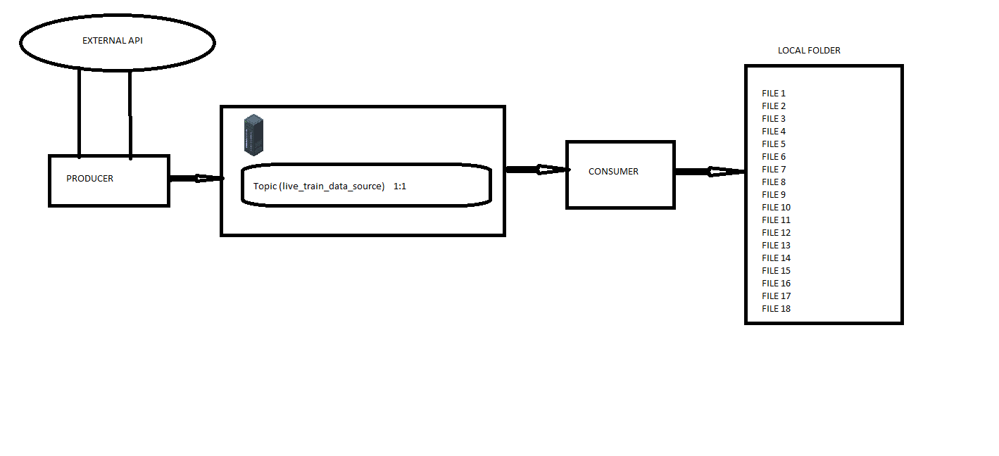
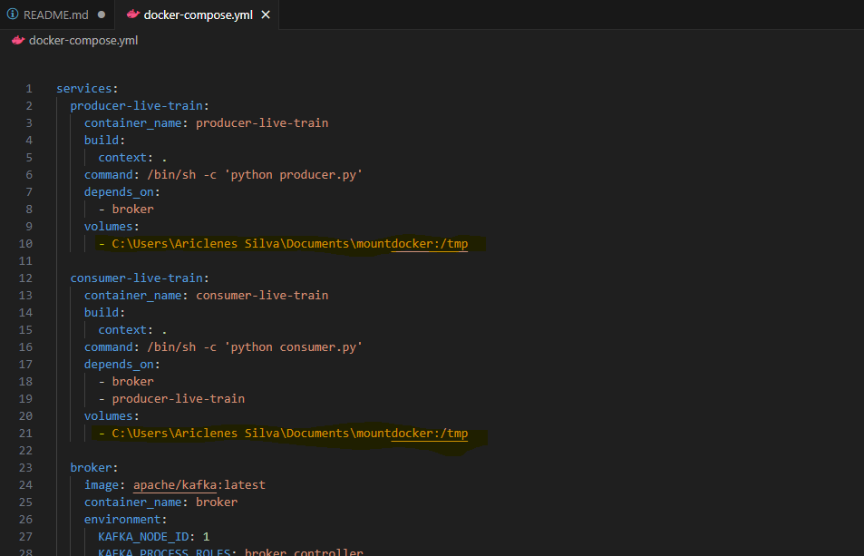

# Technical Exercise

    

Creating a Docker containerized application that retrieves live train data from the [Digitraffic API](https://rata.digitraffic.fi/swagger/#/live-trains/getLiveTrainsByVersion), ingests it using Kafka, performs a data quality assessment, and standardizes and sanitizes the data into a specified format.

*Minimum Objectives*
1. Create a Dockerfile to set up the application environment.
2. Use Kafka to ingest data from the Digitraffic API.
3. Generate a data quality report assessing the quality of the ingested data.
4. Standardize and sanitize the data into a specified format (e.g., converting all dates to a standard format, removing duplicates).

> Technologies used: 
Apache Kafka, Python, Pydantic

## RUN THE APP

**Follow the following steps to run all the containers (roker, producer-live-train, consumer-live-train)**

    $ docker compose up -d

**NOTE:** You might need to make some small changes depending on the OS you are using. The repo was tested using docker desktop running on Windows

**Change the path for mount**

    

The output of the ingestion will be stored in the mount folder of your machine. You can also see the output example [HERE](https://github.com/ariclenessilva/siemensTechnicalInterview/tree/main/outputs_examples)
